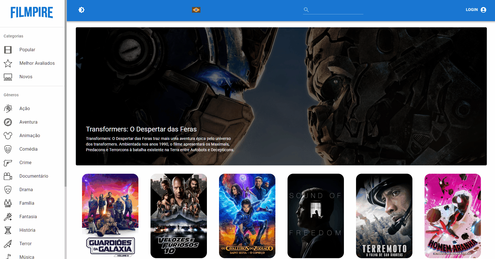
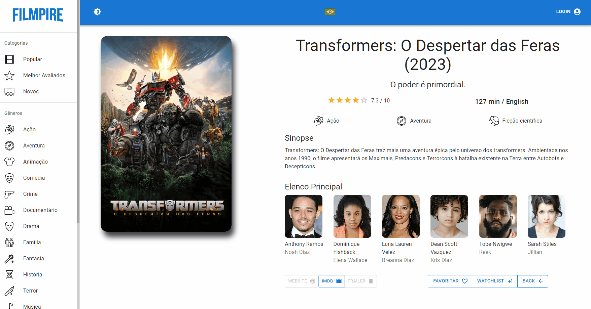
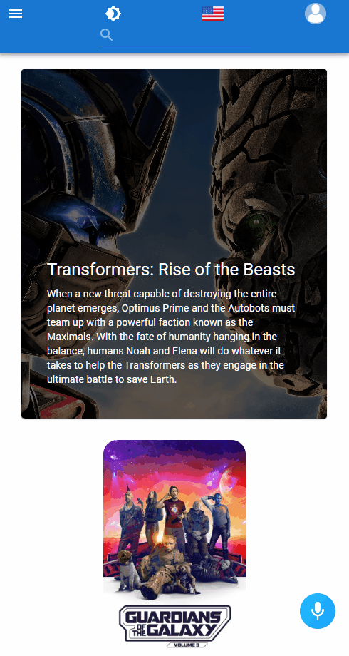
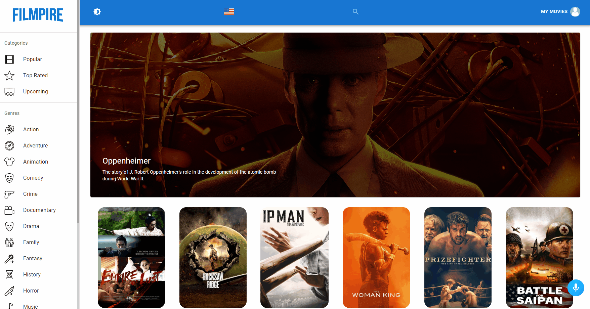
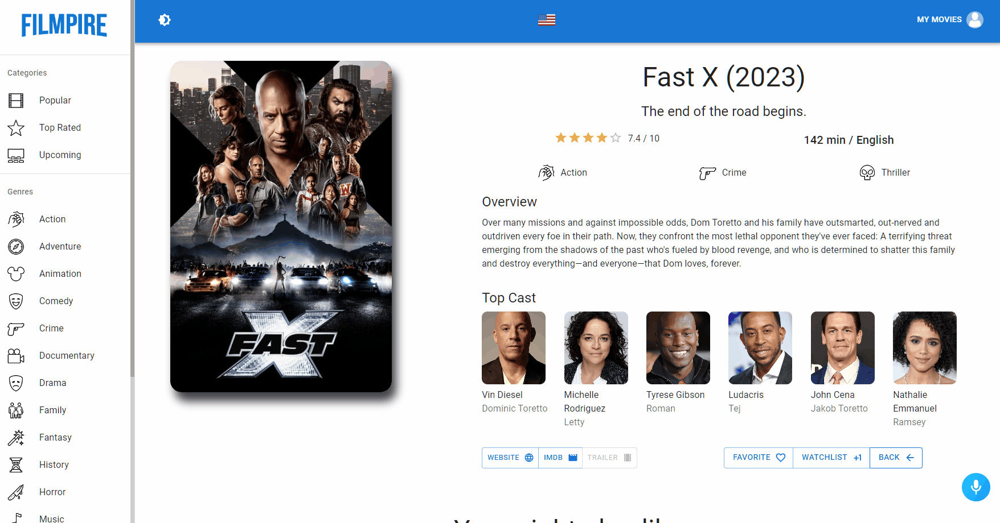

<h1 align="center">
  
 Filmpire
</h1>

<p align="center">
  <a href="#about">About</a>&nbsp;&nbsp;&nbsp;|&nbsp;&nbsp;&nbsp;
  <a href="#Features">Features</a>&nbsp;&nbsp;&nbsp;|&nbsp;&nbsp;&nbsp;
  <a href="#Technologies">Technologies</a>&nbsp;&nbsp;&nbsp;|&nbsp;&nbsp;&nbsp;
  <a href="#Learned">License</a>
</p>

---

<p align="center">
  
</p>

---

<br>
<details align = "left">
<summary> <b> Summary of the Contents </b> <i>(Click here to Expand it!)</i> </summary>
 <br>

<!--ts-->

- About
- Features
  - Toggleable NightMode
  - Choose the Language of your choosing, PT-BR or EN-US
  - Navigate with an AI Assistant when in the EN-US language
  - Expanding and Responsive Menu Hamburguer with Avaliable Genres and Categories
  - Up to Date Movie Cards dynamic generated via API acting as Links to Movie Details
  - Rating and Tooltip of ?/10 of each Movie Card on Hover
  - Dynamic Genre list generated via API
  - Search for any Movie using the SearchBar
  - Create your account to save your favorite movies and see personalized recommendations.
  - Movie Details with:
  - Titles, Taglines, Ratings, Genres, Overview, Top Cast
  - Links to Website, IMDB, Trailer Modal with embeded Youtube Video, Favorite Option and Watchlist Option
  - Recommendations of Movies based on your Favorites, Watchlist and History
  - Actor Details with:
    - Birthday
    - Biography
    - Movies it was casted also
  - Profile Details with:
    - Favorite Movies
    - Watchlisted Movies
- Technologies
- Installing and Contributing
- What have i learned?
- License
- Contributors
- Author
  <!--te-->
   </details

<br>
<br>

<h1 align="center" >
<a href="https://bobnini-filmpire.netlify.app/">🚀 Website Page With Deploy on NETLIFY </a>
</h1>

<h2 id ="about" align="center">📌 About</h2>

**Filmpire** is an AI-Powered Movie Web Application that replicates the popular features of Netflix. It is built using advanced JavaScript tools, including React.js, Redux, Material UI, and Alan AI.

---

> **Track** all your **Movies** with **Filmpire**, never miss the latests and popular Movies, and easily **Learn more about its Details**, Cast and Save as Favorite or to Watch Later.

<h2 id="Features" align="center">⚙️ Features</h2>

<h3> 🧷 Toggleable NightMode</h3>

- On the **Navigation Bar** you can easily toogle between **Dark and Light modes** using the **First Icon (Second Icon on Mobile)**.
<details>
<summary> <b> Demonstration Gif </b> <i>(Click here to Expand it!)</i> </summary>
 <br>
  
</details
<br>
 
 ---

<h3> 🧷 Choose the Language of your choosing, PT-BR or EN-US</h3>

- On the **Navigation Bar** you can easily toogle languages between **PT-BR and EN-US**.
- Changing Language changes the **UI** and the **Data**.
- When in **EN-US**, the **AI Assistant** is **ENABLED**.

<details>
<summary> <b> Demonstration Gif </b> <i>(Click here to Expand it!)</i> </summary>
  <br>
  
</details
<br>

---

<h3> 🧷 Navigate with an AI Assistant (EN-US)</h3>

- When in **EN-US**, the **AI Alan Button appears on the Bottom Right Corner of the Screen**.
- Make it **Listen for Voice Commands after Clicking on its Icon** ( Allow Access to Microphone First).
- Try to say **"Help"** or **"What do you do?"** to get an Overview about the Application and some Commands.

<details>
<summary> <b> List of Commands </b> <i>(Click here to Expand it!)</i> </summary>

**Overview**

> 'Instructions','Help','What do you do?','What does this app do?', 'What can I do here?', 'What is this app about?'
> **Toggle DarkMode**
> 'Make it dark', 'darkmode', 'dark'
> **Toggle LightMode**
> 'Make it light', 'lightmode', 'light'
> **Login**
> 'Log in', 'Login'
> **Logout**
> 'Log out', 'Logout'
> **Go to an Genre(Fantasy) or Category(Top Rated, etc.)**
> 'go to {Genre/Category}'
> **Search for a Movie**
> 'search for {name of movie}'
> **Randomize going to a Genre/Category**
> 'surprise me'

</details>
<details>
<summary> <b> Demonstration Gif </b> <i>(Click here to Expand it!)</i> </summary>
 <br>
 
</details
<br>
 
 ---

<h3> 🧷 Menu Hamburguer ( Mobile Friendly )</h3>

- On **Mobile** the Fixed Menu turns into a **Expanding and Responsive Menu Hamburguer with Avaliable Genres and Categories**.
- Clicking on any of the Options refreshes the Movies and Closes the Menu.
<details>
<summary> <b> Demonstration Gif </b> <i>(Click here to Expand it!)</i> </summary>
 <br>
 
</details
<br>

---

<h3> 🧷 Search Bar</h3>

- **Search for Movies Names** using the search bar in the Middle of the Navigation Bar.

<details>
<summary> <b> Demonstration Gif </b> <i>(Click here to Expand it!)</i> </summary>
  <br>
  
</details
<br>

---

<h3> 🧷 Profile Account</h3>

- Create your account to save your **Favorite Movies** and see personalized recommendations..

<details>
<summary> <b> Demonstration Gif </b> <i>(Click here to Expand it!)</i> </summary>
  <br>
  
</details
<br>

---

<h3> 🧷 Movie Details</h3>

- **Up to Date** Movie Cards dynamic generated via API acting as **Links to Movie Details**.
- Movie Details Page with the following Features:

  - **Titles, Taglines, Ratings, Genres, Overview, Top Cast**.
  - Links to: **Website, IMDB, Trailer Modal with embeded Youtube Video, Favorite Option and Watchlist Option**.
  - **Recommendations of Movies**

<details>
<summary> <b> Demonstration Gif </b> <i>(Click here to Expand it!)</i> </summary>
  <br>
  
</details
<br>

---

<h3> 🧷 Actor Details</h3>

- **Birthday, Biography**.
- **List of Movies it was casted also** on the Recommendations at the Bottom.

<details>
<summary> <b> Demonstration Gif </b> <i>(Click here to Expand it!)</i> </summary>
 <br>
 
</details
<br>

---

<h3> 🧷 Profile Details</h3>

- **List of Favorited Movies on the Account**.
- **List of Watchlisted Movies on the Account**.

<details>
<summary> <b> Demonstration Gif </b> <i>(Click here to Expand it!)</i> </summary>
 <br>
 
</details
<br>

---

<h2 id="Technologies" align="center">💻 Technologies</h2>

In this project it was utilized: <i>**Javascript, React && Redux ToolKit, MUI, Alan AI, ESLint**</i><br><br>

- <i>**JavaScript**</i> - The **Programming Language**.<br>
- <i>**React && Redux ToolKit**</i> - The **Builder of User Interfaces** and responsible for **Persisting Data** and **Dynamically Consuming APIs**.<br>
- <i>**MUI**</i> - The **Page layout, Responsiveness and Style**<br>
- <i>**Alan AI**</i> - The **Voice AI Assistant** that **Navigates and Interacts** with the application.<br>
- <i>**ESLint**</i> - The **Tool that makes your Code Clean**.<br>

<h2 align="center"> 📦 Installing and Contributing</h2>
  
To get started, fork the repository and then run the following commands:

1. Install NPM packages

```sh
npm install
```

2. Configure your .ENV
   Get a free TMDB API Key at - [https://www.themoviedb.org/](https://www.themoviedb.org/).

```sh
REACT_APP_TMDB_KEY=<put your key here>
```

(Optional) Get your Alan AI Key at - [https://alan.app/](https://alan.app/)

```sh
REACT_APP_ALAN_SDK_KEY=<put your key here>
```

3. Start the Local Server

```sh
npm run start
```

4. If you have problems connecting with REST Calls, disable any Adblock/Ghostery or similar extensions.

<br>

Contributions are what make the open source community such an amazing place to learn, inspire, and create. Any contributions you make are **greatly appreciated**.
</br></br>
✏️ To contribute, do the following:

1. Fork the Project
2. Create your Feature Branch. (`git checkout -b feature/AmazingFeature`)
3. Commit your Changes. (`git commit -m 'Adding some AmazingFeature'`)
4. Push to the Branch. (`git push origin feature/AmazingFeature`)
5. Open a Pull Request

<h2 id="Learned" align="center">☕ What have i learned?</h2>

> With this project i was able to further advance my **Technical Skills and Knowledge** with React and Javascript in general, using **Redux Toolkit** to persist my Data and **RTK Query** to easily integrate the whole Aplication by **Dynamically Consuming APIs**<br>
> It was also my first contact with **Material UI (MUI)** and i love how simple it is to create **Good and Responsive Styles** with its **suite of UI tools full of fully-loaded component library**. Its also easy to **Integrate your Custom Styles** with it too.<br>
> Got to learn how to **Use and Integrate a Personal AI Assistant** on the Application, capable of **Interacting with different Options and Making Actions via English Voice Command**.<br>
> I learned how to setup and configure **ESlint** to my needs to mantain **Clean and Formatted Structured Code**.<br>
> Also learned the one of the best **Refactoring and Componentization Practices** on the actual Market. <br>
> It inspired me to create my own **Custom Language Options** for the User to **Switch between 'pt-BR' and 'en-US'**.

## 📝 License

Distributed under the **MIT** License.

## 🤝 Contributors

Thanks to the following people who contributed to this project in some way:
<br><br>
<b>Nobody yet, see something that you want to improve on this project? Share it with me!.<b/>

<!--<table>
  <tr>
    <td align="center">
      <a href="">
        <!--<br>
        <sub>
          <b></b>
        </sub>
      </a>
    </td>
  </tr>
</table>-->

<h2>Author</h2>

Made with 💜 and dedication by me **Guilherme G Cadilhe** Aka: **Bobnini**. <br>

<h2>Acknowledgments</h2>

Used resources:

- [The Movie DB API Documentation](https://developers.themoviedb.org/3/getting-started/introduction)
- [Alan AI Documentation](https://alan.app/docs/)
- [MUI Library](https://mui.com/)
- [JavaScript Mastery](https://www.jsmastery.pro/)
